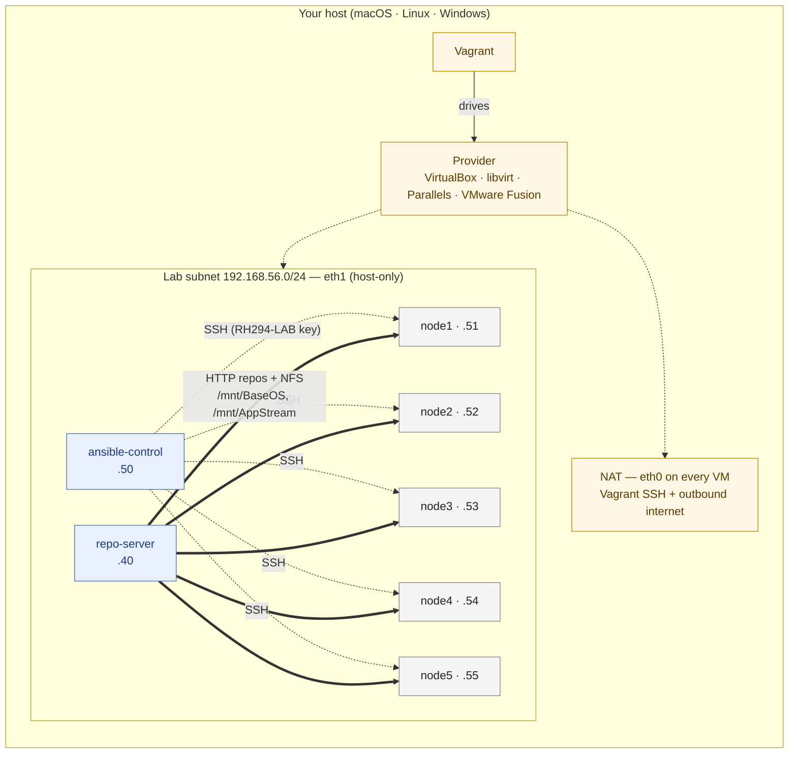

# Design overview

This is the single document that tells you how the whole lab fits together.
Read this once before you go spelunking through the scripts.

## What problem the lab solves

The RHCE (EX294) exam tests Ansible automation against a small fleet of
RHEL 9 hosts. To practice meaningfully you need:

- A control node with `ansible-core` and `ansible-navigator`.
- Five managed nodes with predictable IPs and groupings.
- A package source that works without internet — once the lab is up,
  practice should never depend on a connection.
- Predictable extra storage for the LVM / partition tasks.
- A way to **reset** the whole environment between attempts.

The lab provides all five.

## Architecture in one diagram

## Provisioner pipeline

When you run `vagrant up`, each VM goes through this chain in order:

1. **Provider clone** — the provider clones from the cached box image.
2. **File uploads** (`vagrant file` provisioners) — the `RH294-LAB` keypair
   and `vimrc` are copied to `/tmp/`.
3. **`scripts/common/base-setup.sh`** — installs `firewalld`,
   `NetworkManager`, base CLI tools; binds the lab subnet to firewalld's
   `internal` zone.
4. **`scripts/common/configure-lab-network.sh`** — writes a NetworkManager
   keyfile that puts the lab IP on `eth1` with `connection.zone=internal`.
5. **`scripts/common/create-users.sh`** — creates the `student` and
   `redhat` users with passwordless sudo.
6. **Role-specific** — exactly one of:
   - **`scripts/repo-server/*`** on `repo`: `dnf reposync` of BaseOS +
     AppStream into `/var/www/html/repo`, HTTP and NFS exports, GPG key.
     This is the one moment the lab needs internet — see
     [Offline package mirror](offline-mirror.md).
   - **`scripts/control/setup-control.sh`** on `control`: ansible-core,
     navigator, EE image pull, populated `/etc/hosts`.
   - **`scripts/node/setup-node.sh`** on `node*`: point dnf at the lab
     mirror (offline by default), authorize the control node's SSH key,
     build the `research` VG on the second extra disk, NFS-automount
     the mirror for the task 2 deliverable.

All provisioners are **idempotent** — re-running them after a partial
failure is safe and is how you recover. See
[Troubleshoot a provisioner failure](../how-to/troubleshoot-provisioning.md).

## Network model

Two interfaces per VM:

- `eth0` (NAT, from the provider): how Vagrant SSHes in, how guests reach the
  internet for package downloads. Bound to firewalld's `public` zone.
- `eth1` (host-only / private network): the 192.168.56.0/24 lab subnet.
  Configured **in-guest** by `nmcli`, not by Vagrant. Bound to firewalld's
  `internal` zone.

Why in-guest? AlmaLinux 9.6+ stopped reading `/etc/sysconfig/network-scripts/ifcfg-*`
files, but Vagrant's RedHat guest plugin still writes them. The result is
that `config.vm.network` is silently ignored across all providers. The lab
declares `auto_config: false` and uses `nmcli` to write a proper
NetworkManager keyfile — uniform across all four providers. See
[Explanation: in-guest network configuration](in-guest-network-config.md).

## Why native-arch only

Earlier designs tried to support arm64 hosts running x86_64 guests via QEMU
TCG emulation. That hit unresolvable upstream bugs (vagrant-qemu silently
ignores `config.vm.network`; AlmaLinux 9 has an SSH version-banner timeout
under vagrant-qemu — issue #67). The lab now matches host and guest
architectures: arm64 hosts run arm64 guests, x86_64 hosts run x86_64
guests. See [native-arch only](native-arch-only.md).

## Why these provider choices

| Host                          | Provider         | Why                                               |
| ----------------------------- | ---------------- | ------------------------------------------------- |
| macOS Intel / Linux / Windows | `virtualbox`     | Free, mature, multi-platform.                     |
| Linux                         | `libvirt`        | Native KVM acceleration, best on Linux.           |
| macOS Apple Silicon (paid)    | `parallels`      | Native arm64 with HVF.                            |
| macOS Apple Silicon (free)    | `vmware_desktop` | Fusion 13 is free for personal use post-Broadcom. |

Hyper-V (Windows native), `vagrant_utm`, and `vagrant-qemu` are explicitly
unsupported — see [per-provider quirks](per-provider-quirks.md).

## Why these storage choices

NVMe (Fusion), virtio-blk (libvirt), SATA/SCSI (VirtualBox/Parallels) all
show different device names in the guest. The lab's `setup-node.sh` probes
for `/dev/sdc`, `/dev/vdc`, and `/dev/nvme0n3` in order and uses whichever
exists for the `research` VG. **Task 17's reference solution does the
same** — it discovers the raw disk via `ansible_facts.devices` at runtime
instead of hard-coding a device name. See
[Storage layout](../reference/storage-layout.md).

The two extra disks are intentionally asymmetric:

- Disk 1 (2 GiB) — task 17's raw partition target. 1200 MiB always fits.
- Disk 2 (1 GiB) — task 16's `research` VG. 1200 MiB does NOT fit, so
  the playbook's `rescue:` branch falls back to 800 MiB. That's how a
  student knows the rescue logic actually fires.

## Why the offline mirror

`dnf reposync` on the repo VM mirrors BaseOS + AppStream during initial
provisioning, and every managed node points dnf at that mirror via
`/etc/yum.repos.d/lab-offline.repo` (with vendor online repos disabled).
The benefits over the previous "drop an ISO in `iso/`" pattern:

- No manual step. Internet is needed only once, during first
  `vagrant up`.
- The mirror is current — `reposync` pulls today's metadata, not
  whatever ISO you grabbed last quarter.
- Provider-agnostic. No per-hypervisor CD-ROM attach syntax.
- Idempotent. Re-provisioning the repo VM does a delta sync, not a full
  re-pull.

See [Offline package mirror](offline-mirror.md) for the full design.

## Why these NFS choices

The lab's repo NFS exports use **systemd automount** rather than fstab+`bg`.
Boot is never blocked even if the repo server is briefly unreachable; the
mount activates on first access (`ls /mnt/BaseOS/`). Idle mounts drop after
10 minutes. See [NFS automount](nfs-automount.md).

## Why these ansible-navigator choices

Three install paths, in preference order:

1. RHEL + active subscription → `dnf install ansible-navigator` from the
   AAP repo. Exam-realistic.
2. EPEL `dnf install ansible-navigator` if EPEL packages it.
3. `python3.11 -m pip install --user ansible-dev-tools` as `student`,
   compiling `onigurumacffi` from source against EPEL's `oniguruma-devel`.

The execution environment image is `ghcr.io/ansible/community-ansible-dev-tools:latest`
(multi-arch, current default). The older `quay.io/ansible/creator-ee` is
archived. See [`ansible-navigator` install paths](ansible-navigator-install.md).

## Related

Read these next for depth on individual decisions:

- [native-arch only](native-arch-only.md)
- [in-guest network configuration](in-guest-network-config.md)
- [firewalld zones](firewalld-zones.md)
- [NFS automount](nfs-automount.md)
- [Offline package mirror](offline-mirror.md)
- [`ansible-navigator` install paths](ansible-navigator-install.md)
- [per-provider quirks](per-provider-quirks.md)
- [Known task discrepancies](known-task-discrepancies.md)
