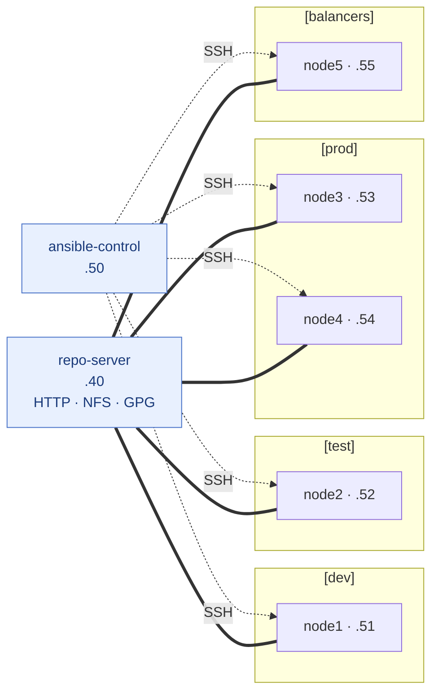

# Topology

Seven VMs on a single private subnet.

## At a glance



Solid lines = repo services (HTTP repos + NFS automount). Dotted lines = ansible control over SSH. The `[webservers:children]` group is an alias for `[prod]`.

## VMs

| Vagrant name | Hostname          | Lab IP        | RAM     | vCPU | Role                                  |
| ------------ | ----------------- | ------------- | ------- | ---- | ------------------------------------- |
| `repo`       | `repo-server`     | 192.168.56.40 | 1024 MB | 2    | HTTP repos, NFS exports, GPG key host |
| `control`    | `ansible-control` | 192.168.56.50 | 2048 MB | 2    | Ansible control node                  |
| `node1`      | `node1`           | 192.168.56.51 | 1280 MB | 1    | Managed node — group `dev`            |
| `node2`      | `node2`           | 192.168.56.52 | 1280 MB | 1    | Managed node — group `test`           |
| `node3`      | `node3`           | 192.168.56.53 | 1280 MB | 1    | Managed node — group `prod`           |
| `node4`      | `node4`           | 192.168.56.54 | 1280 MB | 1    | Managed node — group `prod`           |
| `node5`      | `node5`           | 192.168.56.55 | 1280 MB | 1    | Managed node — group `balancers`      |

All defaults are configurable in [`config.yaml`](config-yaml.md).

## Hypervisor VM names

The display name shown by `VBoxManage`, `prlctl`, `virsh`, and Fusion is
prefixed with `rhce-`:

- `rhce-repo-server`
- `rhce-ansible-control`
- `rhce-node1`, `rhce-node2`, `rhce-node3`, `rhce-node4`, `rhce-node5`

## NICs per VM

Every VM has two network adapters:

| Interface | Type            | Used for                                                            |
| --------- | --------------- | ------------------------------------------------------------------- |
| `eth0`    | NAT             | Vagrant SSH (forwarded host port → guest 22)                        |
| `eth1`    | private network | Lab subnet `192.168.56.0/24`, configured in-guest by NetworkManager |

## Ansible groups (intended target inventory)

The lab does not pre-create `/etc/ansible/hosts` — task 1 asks the student
to build the inventory. The expected groupings, used by the reference
solutions:

```ini
[dev]
node1

[test]
node2

[prod]
node3
node4

[balancers]
node5

[webservers:children]
prod
```

## Host resource cost

Approximate footprint when all seven VMs are running:

- RAM: ~10 GB (1 + 2 + 5×1.28)
- vCPU: ~9 (oversubscribed; 4-core hosts work fine)
- Disk: ~80 GB total across all VM clones + the cached box image

## Related

- [`config.yaml`](config-yaml.md) — change any of these defaults.
- [Networking](networking.md) — subnet, zones, NFS exports.
- [Storage layout](storage-layout.md) — extra disks per node.
